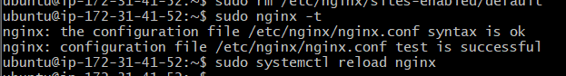
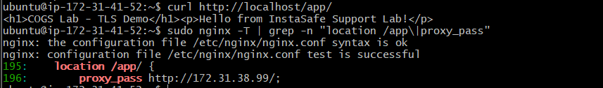
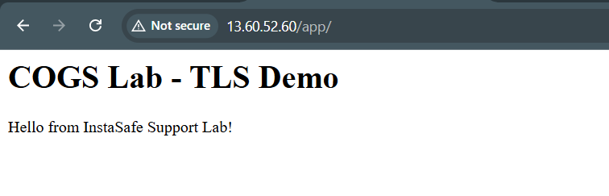
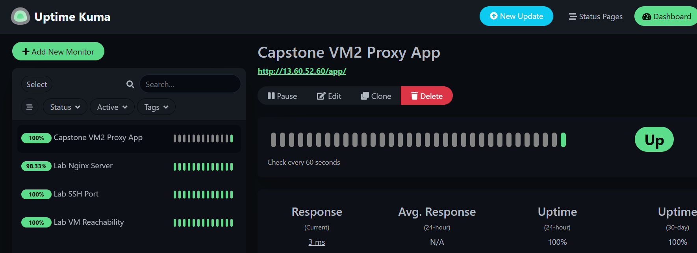
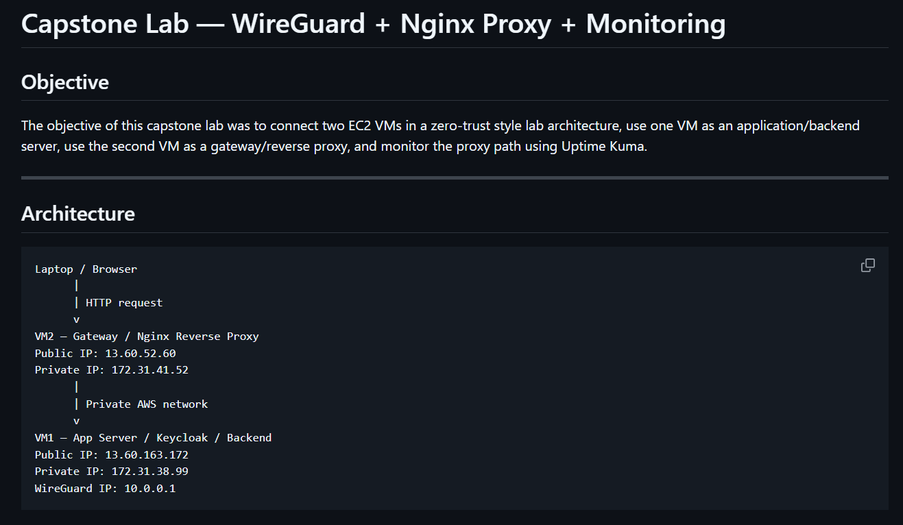
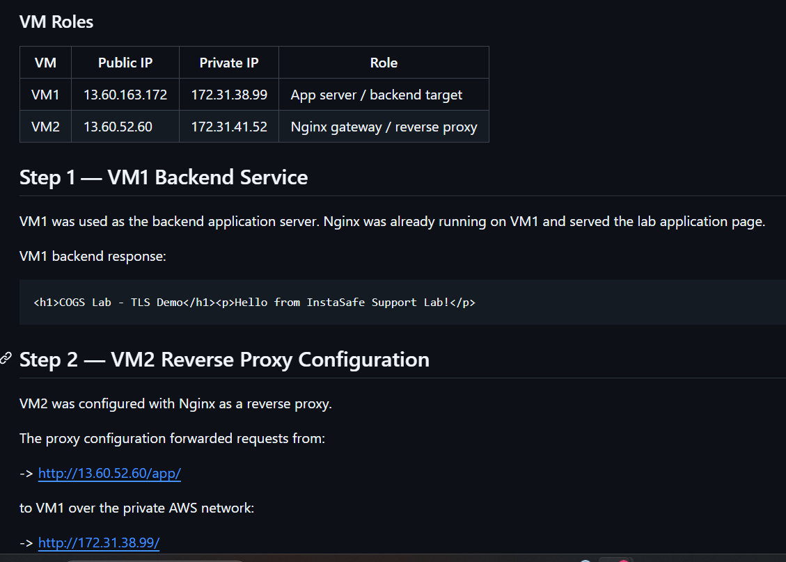

# Capstone Lab — WireGuard + Nginx Proxy + Monitoring

## Objective

The objective of this capstone lab was to connect two EC2 VMs in a zero-trust style lab architecture, use one VM as an application/backend server, use the second VM as a gateway/reverse proxy, and monitor the proxy path using Uptime Kuma.

---

## Architecture

```text
Laptop / Browser
      |
      | HTTP request
      v
VM2 — Gateway / Nginx Reverse Proxy
Public IP: 13.60.52.60
Private IP: 172.31.41.52
      |
      | Private AWS network
      v
VM1 — App Server / Keycloak / Backend
Public IP: 13.60.163.172
Private IP: 172.31.38.99
WireGuard IP: 10.0.0.1
```
### VM Roles
| VM  | Public IP     | Private IP   | Role                          |
| --- | ------------- | ------------ | ----------------------------- |
| VM1 | 13.60.163.172 | 172.31.38.99 | App server / backend target   |
| VM2 | 13.60.52.60   | 172.31.41.52 | Nginx gateway / reverse proxy |

## Environment Variables / Lab Mapping

```text
VM1_PUBLIC_IP=13.60.163.172
VM1_PRIVATE_IP=172.31.38.99

VM2_PUBLIC_IP=13.60.52.60
VM2_PRIVATE_IP=172.31.41.52

BACKEND_APP=http://172.31.38.99/
GATEWAY_PROXY=http://13.60.52.60/app/
```

## Step 1 — VM1 Backend Service

VM1 was used as the backend application server. Nginx was already running on VM1 and served the lab application page.



VM1 backend response:
```text
<h1>COGS Lab - TLS Demo</h1><p>Hello from InstaSafe Support Lab!</p>
```
## Step 2 — VM2 Reverse Proxy Configuration

VM2 was configured with Nginx as a reverse proxy.

The proxy configuration forwarded requests from:

-> http://13.60.52.60/app/

to VM1 over the private AWS network:

-> http://172.31.38.99/

Nginx proxy configuration used:
```text
server {
    listen 80;
    server_name _;
    location /app/ {
        proxy_pass http://172.31.38.99/;
        proxy_set_header Host $host;
        proxy_set_header X-Real-IP $remote_addr;
        proxy_set_header X-Forwarded-For $proxy_add_x_forwarded_for;
    }
    location /health {
        return 200 "capstone gateway healthy\n";
        add_header Content-Type text/plain;
    }
}
```
Note:

In this lab environment, the backend application IP was statically configured using the VM1 private IP:

```nginx
proxy_pass http://172.31.38.99/;
```

In a production environment, this would normally be replaced with:

- internal DNS
- service discovery
- load balancer hostname
- environment variables
- container service names

to avoid hardcoded infrastructure dependencies.

Nginx configuration was tested successfully and reloaded.

## Step 3 — Proxy Path Validation

The proxy path was tested from VM2 using curl.

### Command used:
```text
curl http://localhost/app/
```


### Observed response:

<h1>COGS Lab - TLS Demo</h1><p>Hello from InstaSafe Support Lab!</p>

This confirmed that VM2 was successfully proxying traffic to VM1.

The proxy was also tested from the browser using:

-> http://13.60.52.60/app/



## Step 4 — Monitoring with Uptime Kuma

A Uptime Kuma monitor was created to monitor the VM2 proxy URL:

-> http://13.60.52.60/app/

The Uptime Kuma monitor continuously validated the full proxy path from VM2 to the backend application on VM1. This confirmed both gateway availability and backend reachability across the private AWS network.



### Result

The capstone lab successfully connected two EC2 VMs in a gateway/backend architecture.

### Final working flow:

The architecture simulated a simplified zero-trust gateway pattern where:

- VM2 acted as the externally reachable gateway/reverse proxy
- VM1 acted as the protected backend application server
- traffic between VMs used private AWS networking
- monitoring validated end-to-end application reachability

VM2 accepted the public HTTP request and forwarded it to VM1 using the private AWS network.


---

## GitHub Documentation Evidence

The capstone findings file was created and committed in the GitHub portfolio.






The key learning was that the proxy can work locally on the VM but still fail from the browser if AWS Security Group inbound rules do not allow the required port.

# 500-Word Reflection — What I Learned from the Capstone

This capstone lab helped connect all the concepts from the earlier modules into a single operational workflow. Earlier labs focused on individual technologies such as networking, TLS, Keycloak, monitoring, incident response, and change management. The capstone demonstrated how these technologies interact together in a realistic support-engineering environment.

The most important learning was understanding the role of a gateway architecture. VM2 acted as the externally accessible gateway while VM1 acted as the protected backend application server. The reverse proxy configuration showed how external users can interact with internal services without directly exposing the backend system to the public internet. This closely matches how Zero Trust and gateway-based enterprise architectures work in real organizations.

The capstone also improved my understanding of private versus public networking. The browser accessed VM2 using the public IP address, but VM2 communicated with VM1 using the AWS private IP address. This separation helped demonstrate how backend services can remain isolated while still being reachable through controlled proxy paths.

Another major learning area was monitoring and observability. Uptime Kuma was not only used to check whether the service was reachable, but also to validate the full application path through the gateway. During the incident simulation labs, I learned how monitoring tools detect service-level failures differently from infrastructure-level failures. For example, the VM itself could remain online while the Nginx service became unavailable. Understanding this distinction is important for support and incident-response roles.

The incident-response and change-management labs were especially valuable because they emphasized operational discipline rather than only technical commands. Writing acknowledgements, escalation comments, PIR documents, rollback plans, and PACE handovers demonstrated how communication and process management are critical during real incidents. The staged Git commits also showed how change-management evidence can prove that planning happened before implementation.

I also learned the importance of documentation quality. Reviewer feedback highlighted that technical work alone is not sufficient if screenshots, configuration evidence, and navigation clarity are missing. This reinforced that support engineers must provide reproducible evidence and operationally useful documentation rather than only describing what was done.

One limitation of the current capstone is that the architecture still uses AWS private networking instead of a complete WireGuard tunnel path. In a production-grade ZTNA architecture, traffic would normally flow through a secure tunnel with stronger identity-aware access controls and centralized policy enforcement. Similarly, production systems would use DNS names, service discovery, load balancers, and automated infrastructure management instead of static IP addresses.

Overall, this capstone significantly improved my understanding of networking, monitoring, incident response, operational workflows, and infrastructure troubleshooting. More importantly, it demonstrated how individual technologies combine into a real support-engineering environment rather than functioning as isolated tools.
