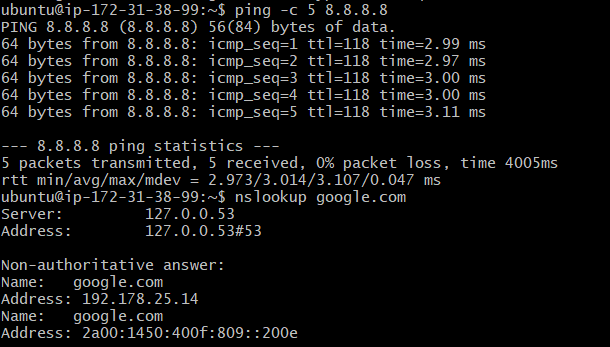
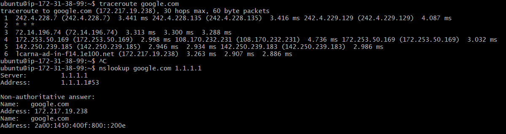
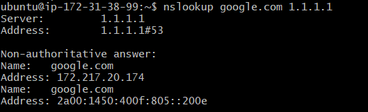
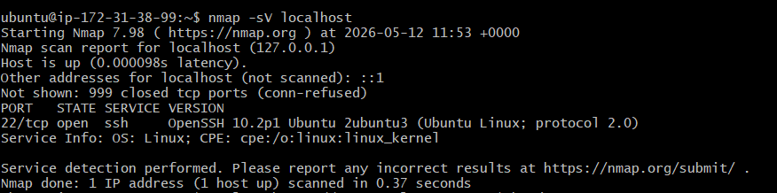
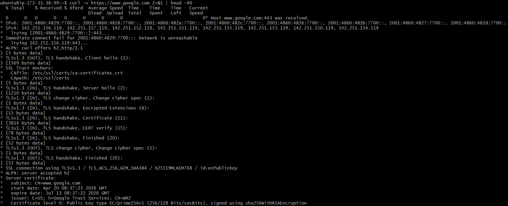
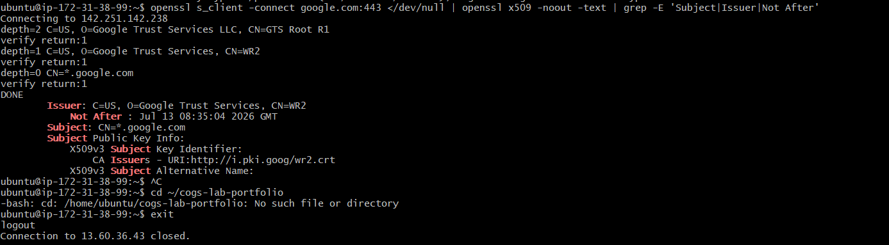

Lab 1.1 Findings
My VM Details 

- Provider: AWS
- Region: eu-north-1
- OS: Ubuntu 26.04 LTS

> Experiment Results

1. Ping to 8.8.8.8

- Average RTT: 3.014 ms
- TTL value observed: 118
- What does TTL tell us about the path?

TTL means Time To Live. It shows how many router hops a packet can pass through before it is dropped. The TTL value helps understand the network path between my VM and the destination. A lower TTL value usually means the packet passed through more routers.

2.Traceroute to google.com

- Number of hops: 6
- Any `* * *` hops? At which hop number?

Yes, `* * *` was observed at hop 2.

`* * *` means that the router at that hop did not reply to the traceroute request. This can happen because some routers or firewalls block ICMP/traceroute packets. It does not always mean the connection failed, because the traceroute still reached google.com at hop 6.

3.DNS Comparison

- Result from default DNS: 192.178.25.14
- Result from 1.1.1.1: 172.217.19.238
- Are they different? Why might they differ?

Yes, they are different. The default DNS resolver returned 192.178.25.14, while Cloudflare DNS 1.1.1.1 returned 172.217.19.238. DNS results can differ because different resolvers may use different cache data, geographic routing, CDN/load balancing, or resolver policies.

4. google.com TLS Certificate

- Issuer: C=US, O=Google Trust Services, CN=WR2
- Expiry date: Jul 13 08:35:04 2026 GMT
- TLS version used: TLSv1.3
  Experments:
  1. Experiment 1: Ping Test
 #### Screenshot

  2.  EXPERIMENT 2: Traceroute
#### Screenshot

3. EXPERIMENT 3: DNS Investigation
   #### Screenshot

4.  EXPERIMENT 4: Port Scanning
   #### Screenshot

5. EXPERIMENT 5: TCP Connection Test
   #### Screenshot

   
6.  EXPERIMENT 6: SSL Certificate Inspection
 #### Screenshot

  

