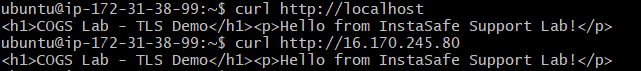
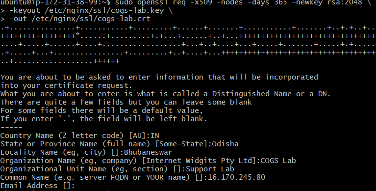
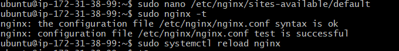
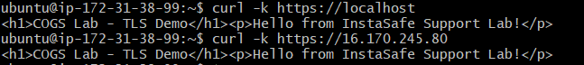
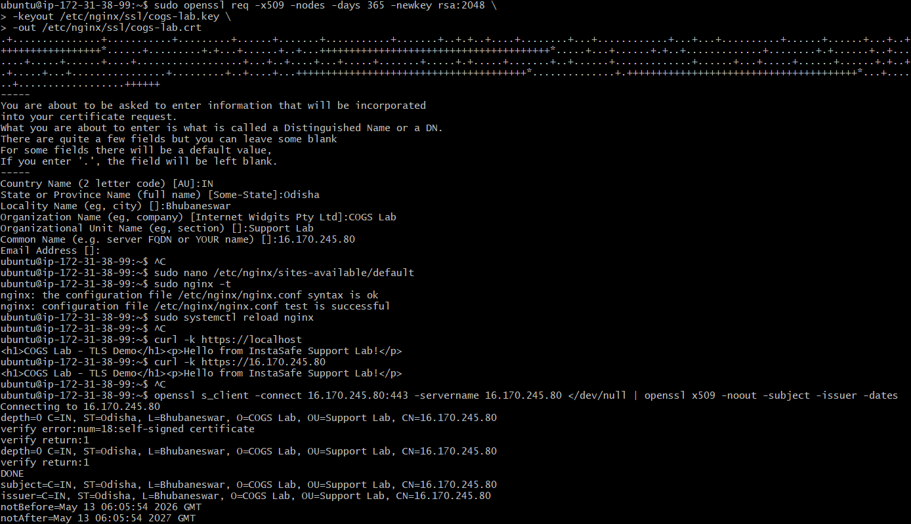

# Lab 1.2 Findings

## Lab Title

Nginx Web Server and Self-Signed TLS Certificate Setup

## My VM Details

- Provider: AWS
- Region: eu-north-1
- OS: Ubuntu 26.04 LTS
- Public IPv4: 16.170.245.80
- VM User: ubuntu

---

## Experiment 1: Nginx HTTP Test

## Experiment 2: Self-Signed Certificate Creation

## Experiment 3: Nginx HTTPS Configuration Test

## Experiment 4: HTTPS Test

## Experiment 5: TLS Certificate Inspection

