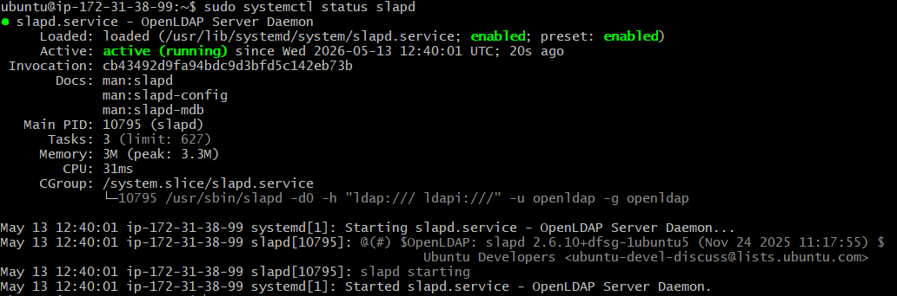
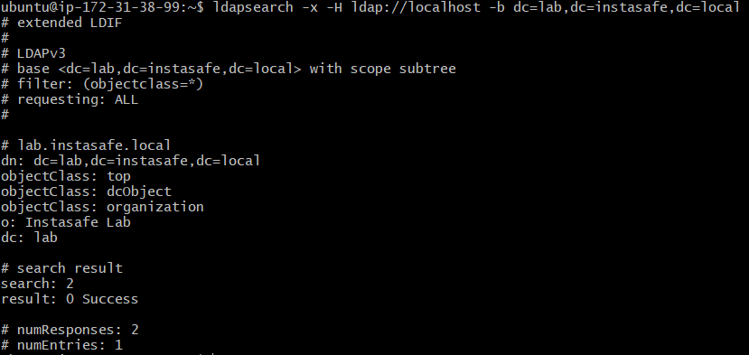
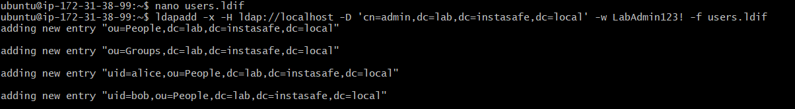
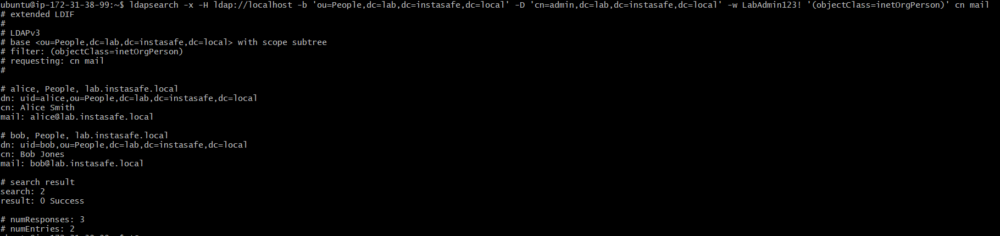
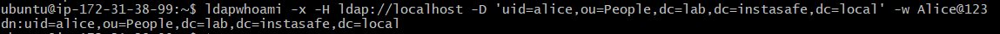
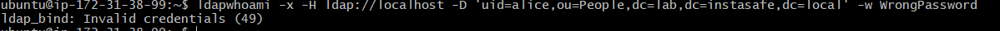

# Lab 2.1 Findings

## Lab Title

OpenLDAP Directory Setup and Authentication Testing

---

## My VM Details

- Provider: AWS
- Region: eu-north-1
- OS: Ubuntu
- Role: LDAP Server

---

## Experiment 1: OpenLDAP Service Status Check

### Commands Used

```bash
sudo apt update
sudo apt install -y slapd ldap-utils
sudo dpkg-reconfigure slapd
sudo systemctl status slapd
```
### Output/Result

The OpenLDAP service was installed and configured successfully.
The slapd service showed as active and running.

### Observation

This confirmed that the LDAP server process was running properly on the VM.



## Experiment 2: Base LDAP Directory Search
### Command Used
```
ldapsearch -x -H ldap://localhost -b dc=lab,dc=instasafe,dc=local
```
### Output / Result
```
dn: dc=lab,dc=instasafe,dc=local
objectClass: top
objectClass: dcObject
objectClass: organization
o: Instasafe Lab
dc: lab

result: 0 Success
numEntries: 1
```
### Observation

The base LDAP directory was created successfully with the domain:
```
dc=lab,dc=instasafe,dc=local
```


## Experiment 3: Adding LDAP Users and Organizational Units
 ### LDIF File Used
 ```
dn: ou=People,dc=lab,dc=instasafe,dc=local
objectClass: organizationalUnit
ou: People

dn: ou=Groups,dc=lab,dc=instasafe,dc=local
objectClass: organizationalUnit
ou: Groups

dn: uid=alice,ou=People,dc=lab,dc=instasafe,dc=local
objectClass: inetOrgPerson
uid: alice
cn: Alice Smith
sn: Smith
mail: alice@lab.instasafe.local
userPassword: Alice@123

dn: uid=bob,ou=People,dc=lab,dc=instasafe,dc=local
objectClass: inetOrgPerson
uid: bob
cn: Bob Jones
sn: Jones
mail: bob@lab.instasafe.local
userPassword: Bob@123
```
### Command Used
```
ldapadd -x -H ldap://localhost -D 'cn=admin,dc=lab,dc=instasafe,dc=local' -w LabAdmin123! -f users.ldif
```
### Output / Result
```
adding new entry "ou=People,dc=lab,dc=instasafe,dc=local"
adding new entry "ou=Groups,dc=lab,dc=instasafe,dc=local"
adding new entry "uid=alice,ou=People,dc=lab,dc=instasafe,dc=local"
adding new entry "uid=bob,ou=People,dc=lab,dc=instasafe,dc=local"
```
### Observation

The People and Groups organizational units were created successfully.
Two LDAP users, Alice and Bob, were also added successfully.



## Experiment 4: Searching LDAP Users
### Command Used
```
ldapsearch -x -H ldap://localhost -b 'ou=People,dc=lab,dc=instasafe,dc=local' -D 'cn=admin,dc=lab,dc=instasafe,dc=local' -w LabAdmin123! '(objectClass=inetOrgPerson)' cn mail
```
### Output / Result
```
dn: uid=alice,ou=People,dc=lab,dc=instasafe,dc=local
cn: Alice Smith
mail: alice@lab.instasafe.local

dn: uid=bob,ou=People,dc=lab,dc=instasafe,dc=local
cn: Bob Jones
mail: bob@lab.instasafe.local

result: 0 Success
numEntries: 2
```
### Observation

The LDAP search returned both users correctly.
This confirmed that Alice and Bob were stored under the People organizational unit.



## Experiment 5: Successful LDAP Authentication
### Command Used
```
ldapwhoami -x -H ldap://localhost -D 'uid=alice,ou=People,dc=lab,dc=instasafe,dc=local' -w Alice@123
Output / Result
dn:uid=alice,ou=People,dc=lab,dc=instasafe,dc=local
```
### Observation

The login was successful because the correct password for Alice was provided.



## Experiment 6: Failed LDAP Authentication
### Command Used
```
ldapwhoami -x -H ldap://localhost -D 'uid=alice,ou=People,dc=lab,dc=instasafe,dc=local' -w WrongPassword
```
Output / Result
```
ldap_bind: Invalid credentials (49)
```
Observation

The login failed because the wrong password was provided.
This confirms that LDAP authentication checks the user credentials before allowing access.



## LDAP to IAM / ZTNA Mapping
| LDAP Component       | IAM / ZTNA Meaning            |
| -------------------- | ----------------------------- |
| LDAP directory       | Identity store                |
| User entries         | User identities               |
| Organizational Units | User/group organization       |
| Bind DN              | Login identity                |
| Password bind        | Password-based authentication |
| Successful bind      | Valid user authentication     |
| Invalid credentials  | Failed authentication attempt |
