# Lab 2.2 Findings

## Lab Title

Keycloak SSO — Build Your Own Identity Provider

---

## Objective

The objective of this lab was to deploy Keycloak as an Identity Provider, create a realm, configure users and groups, verify token generation, configure a SAML client, add attribute mappers, and download IdP metadata.

---

## Environment Details

- Provider: AWS
- OS: Ubuntu
- Public IPv4: 13.60.163.172
- Keycloak Port: 8080
- Keycloak Version: 23.0.0
- Container Name: keycloak

---

## Experiment 1: Deploy Keycloak with Docker

### Command Used

```bash
docker run -d --name keycloak \
-p 8080:8080 \
-e KEYCLOAK_ADMIN=admin \
-e KEYCLOAK_ADMIN_PASSWORD=Admin@Lab123 \
quay.io/keycloak/keycloak:23.0.0 start-dev \
--hostname=13.60.163.172 \
--hostname-strict=false \
--hostname-strict-https=false \
--http-enabled=true
```
Output Observed

Keycloak container started successfully and was accessible on port 8080.

Verification Commands
```
docker ps
docker logs keycloak --tail 30
```
Explanation

Keycloak was deployed using Docker in development mode. The admin user was created using environment variables, and HTTP access was enabled for lab testing.

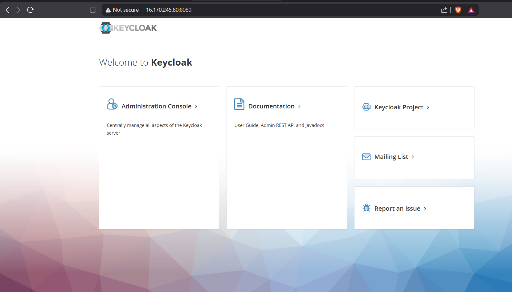

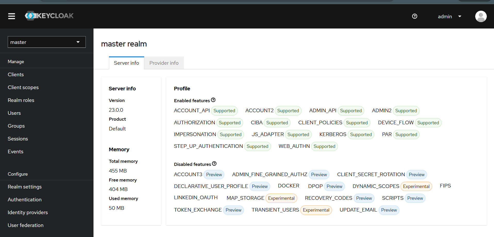

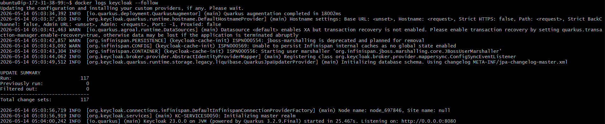

## Experiment 2: Create Realm, User, and Group
### Realm Created
```
instasafe-lab
```
### User Created
```
Username: testuser
Email: testuser@instasafe.local
First Name: Test
Last Name: User
Password: TestUser@123
```
### Group Created
```
support-team
```
### User Group Mapping

The user testuser was added to the support-team group.

### Explanation

The realm represents a separate identity domain. The user and group simulate how enterprise users are managed in an Identity Provider before being used for SSO authentication.

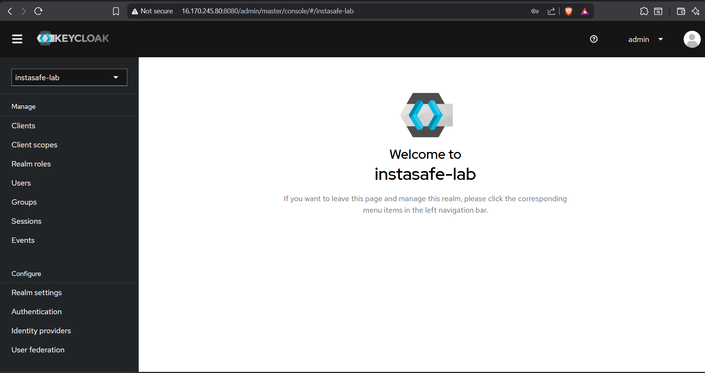

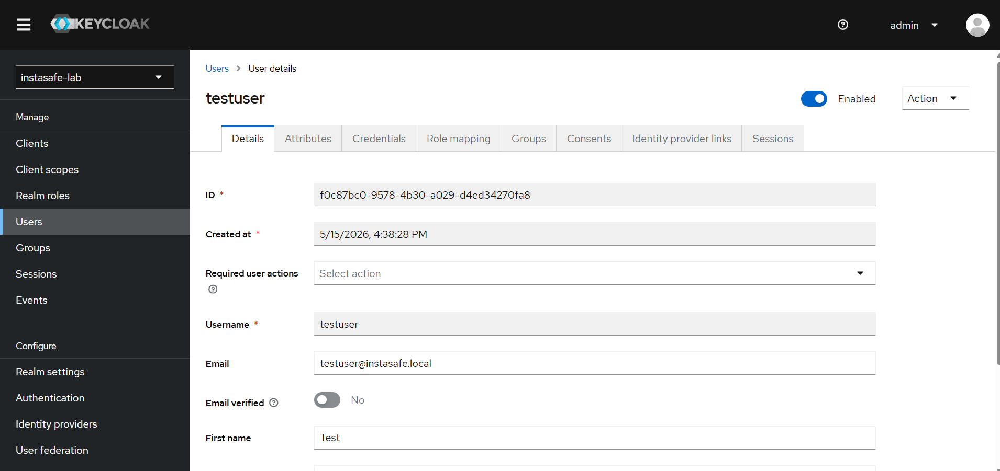

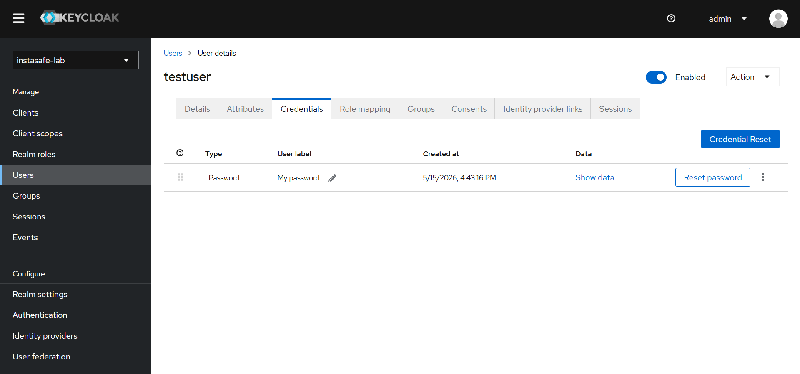

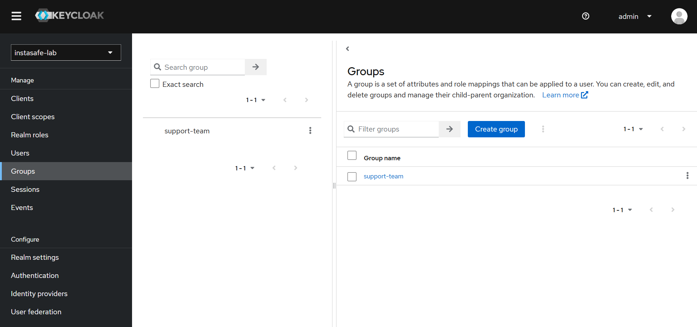

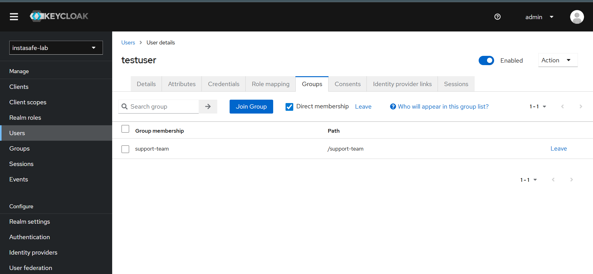

## Experiment 3: API Token Verification
Command Used
```
curl -s -X POST http://13.60.163.172:8080/realms/instasafe-lab/protocol/openid-connect/token \
-d 'client_id=lab-api' \
-d 'grant_type=password' \
-d 'username=testuser' \
-d 'password=TestUser@123' \
| python3 -m json.tool
```
### Output Observed

The command returned an access token, refresh token, token type, expiry time, and user claims.

### Important Claims Observed
```
token_type: Bearer
scope: profile email
preferred_username: testuser
email: testuser@instasafe.local
```
### Explanation

The successful token response confirms that the user authentication worked through Keycloak. This simulates how an application or agent can authenticate a user through an Identity Provider.

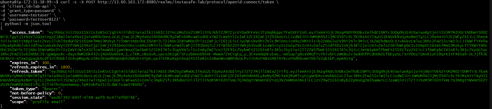

Experiment 4: Configure SAML Client
SAML Client Details
```
Client Type: SAML
Client ID: https://sp.instasafe.local/saml
Name: InstaSafe SP Simulation
```
Client Settings
```
Valid Redirect URI: http://13.60.163.172:9090/saml/callback
Master SAML Processing URL: http://13.60.163.172:9090/saml/callback
```
### Explanation

The SAML client simulates InstaSafe acting as a Service Provider. Keycloak acts as the Identity Provider and sends authentication responses to the configured callback URL.

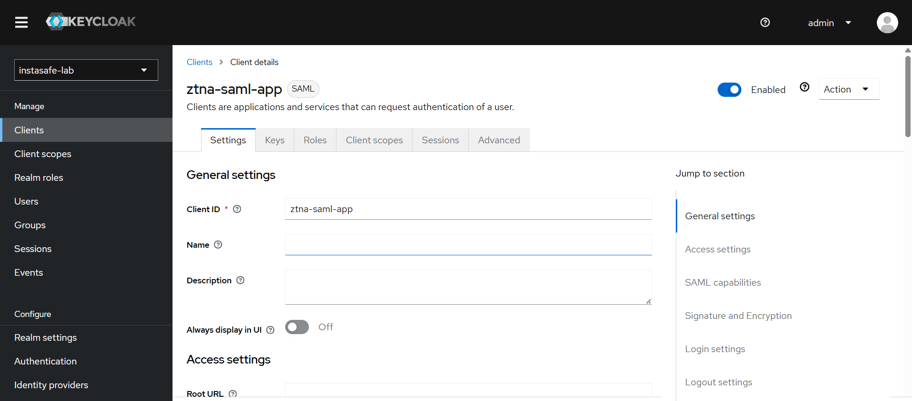

## Experiment 5: Configure Attribute Mappers
### Mappers Configured
```
email mapper
groups mapper
```
### Explanation

Attribute mappers decide which user attributes are included in the SAML response. The email mapper sends the user email, and the group mapper sends group membership information.

These attributes are important because SSO applications often use them for user identification and access control.

### Keycloak Navigation Path

The attribute mappers were configured using the following Keycloak navigation path:

```text
Clients → https://sp.instasafe.local/saml → Client Scopes → Add Mapper → By Configuration → User Attribute
```

For each mapper, the following fields were configured:

- Mapper Type
- User Attribute
- Friendly Name
- SAML Attribute Name
- SAML Attribute NameFormat
- Single Value Attribute

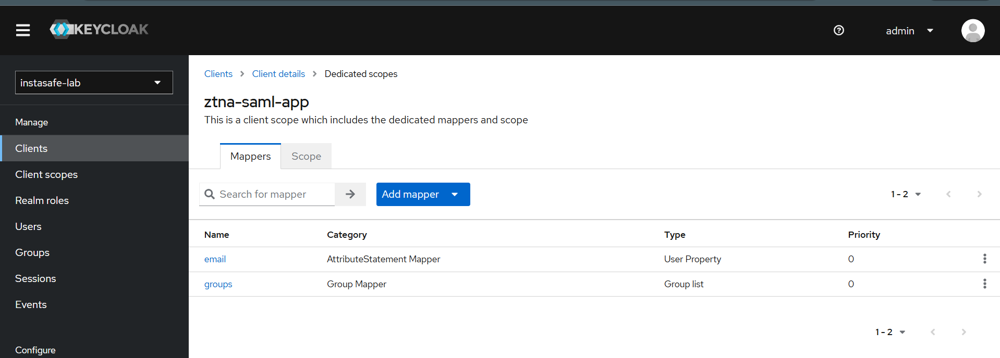

## Experiment 6: Download IdP Metadata
Command Used
```
curl http://13.60.163.172:8080/realms/instasafe-lab/protocol/saml/descriptor -o keycloak-idp-metadata.xml
ls -l keycloak-idp-metadata.xml
head keycloak-idp-metadata.xml
```
### Output Observed

The metadata XML file was downloaded successfully.

### Explanation

The IdP metadata XML contains the Keycloak SAML configuration details. In a real SSO setup, this metadata file is shared with the Service Provider so that it can trust the Identity Provider.


### Troubleshooting Note

During testing, the token request initially failed with:
```
HTTPS required
```
This happened because Keycloak required HTTPS for the realm. The issue was fixed by changing the realm SSL setting:
```
docker exec -it keycloak /opt/keycloak/bin/kcadm.sh update realms/instasafe-lab -s sslRequired=NONE
```
Another token request using admin-cli failed with:
```
Invalid user credentials
```
This was expected because the admin user belonged to the master realm, while the test was being performed against the instasafe-lab realm. A separate public client named lab-api was created, and the token request succeeded using the testuser account.

## Keycloak to ZTNA Component Mapping

| Keycloak Lab Component | ZTNA / SSO Component               |
| ---------------------- | ---------------------------------- |
| Keycloak               | Identity Provider                  |
| Realm                  | Tenant / Organization              |
| User                   | End user identity                  |
| Group                  | User group / access group          |
| SAML Client            | Service Provider application       |
| Attribute Mapper       | Claims / user attributes           |
| IdP Metadata XML       | Trust configuration shared with SP |
| Access Token           | Authenticated session token        |
