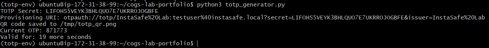
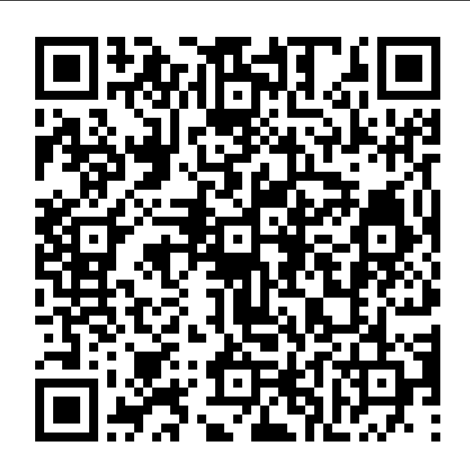
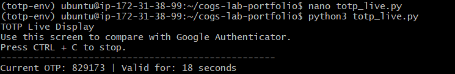
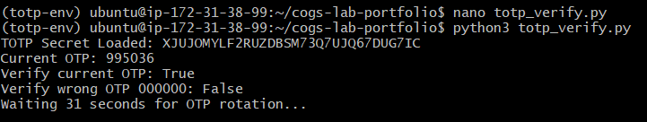

# Lab 2.3 Findings

## Lab Title

TOTP MFA — Build Your Own Authenticator Flow

---

## Objective

The objective of this lab was to understand how Time-Based One-Time Password authentication works, generate a TOTP secret, create a QR code for authenticator enrollment, verify OTP values, and observe OTP rotation after a time interval.

---

## Environment Details

- Provider: AWS
- OS: Ubuntu
- Python Version: Python 3
- MFA Method: TOTP
- Authenticator App Used: Google Authenticator

---

## Experiment 1: Install Python Dependencies

### Commands Used

```bash
sudo apt update
sudo apt install -y python3-pip python3-venv
python3 -m venv totp-env
source totp-env/bin/activate
pip install pyotp qrcode pillow
```
Explanation

The required Python libraries were installed inside a virtual environment.
-pyotp was used to generate and verify TOTP codes.
-qrcode was used to generate the QR code.
-pillow was used as an image dependency for QR generation.

## Experiment 2: Generate TOTP Secret and QR Code
### Script Used
```
import pyotp
import qrcode
import time
import os

SECRET_FILE = "totp_secret.txt"

if os.path.exists(SECRET_FILE):
    with open(SECRET_FILE, "r") as f:
        secret = f.read().strip()
else:
    secret = pyotp.random_base32()
    with open(SECRET_FILE, "w") as f:
        f.write(secret)

print(f"TOTP Secret: {secret}")

totp = pyotp.TOTP(secret)

uri = totp.provisioning_uri(
    name="testuser@instasafe.local",
    issuer_name="InstaSafe Lab"
)

qr = qrcode.make(uri)
qr.save("/tmp/totp_qr.png")
print("QR code saved to /tmp/totp_qr.png")

current_otp = totp.now()
print(f"Current OTP: {current_otp}")
print(f"Valid for: {30 - (int(time.time()) % 30)} more seconds")
```
### Output Observed

The script generated:

-A TOTP secret
-A provisioning URI
-A QR code image
-A current 6-digit OTP
-Remaining validity time



## Experiment 3: QR Code Enrollment
QR Code
The QR code was generated at:
```
/tmp/totp_qr.png
```
The QR code was copied to the local machine and scanned using Google Authenticator.



Note

Google Authenticator blocks screenshots for security reasons. Because of this, a direct screenshot of the authenticator app could not be captured. The OTP displayed in Google Authenticator was manually compared with the server-generated OTP during the same 30-second TOTP window.

## Experiment 4: Live OTP Display
### Script Purpose
A live OTP display script was used to continuously show the current OTP and remaining validity time.

### Output Observed

The terminal displayed the current OTP and countdown timer.



## Experiment 5: OTP Verification and Rotation
### Script Used
```
import pyotp
import time

with open("totp_secret.txt", "r") as f:
    secret = f.read().strip()

totp = pyotp.TOTP(secret)

current_otp = totp.now()

print(f"TOTP Secret Loaded: {secret}")
print(f"Current OTP: {current_otp}")
print(f"Verify current OTP: {totp.verify(current_otp)}")
print(f"Verify wrong OTP 000000: {totp.verify('000000')}")

print("Waiting 31 seconds for OTP rotation...")
time.sleep(31)

new_otp = totp.now()

print(f"New OTP after 31 seconds: {new_otp}")
print(f"Old OTP: {current_otp}")
print(f"OTP changed: {current_otp != new_otp}")
```
### Output Observed

The script confirmed:
```
Verify current OTP: True
Verify wrong OTP 000000: False
OTP changed: True
```
### Explanation

The correct OTP was successfully verified, while an incorrect OTP failed verification. After waiting 31 seconds, the OTP changed, confirming that TOTP codes rotate based on time intervals.



## Root Cause Analysis: Why OTP Fails
An OTP can fail even if the user enters a code from their authenticator app. Common reasons include:
| Cause                         | Explanation                                                                                                   |
| ----------------------------- | ------------------------------------------------------------------------------------------------------------- |
| Time drift                    | TOTP depends on time. If the server time or mobile device time is incorrect, OTP validation can fail.         |
| Expired OTP                   | TOTP codes usually expire every 30 seconds. If the user enters the code too late, it may fail.                |
| Wrong secret                  | If the authenticator app is enrolled with a different secret, it will generate different OTPs.                |
| Wrong account selected        | Users may have multiple accounts in the authenticator app and may enter the OTP from the wrong account.       |
| QR re-generated               | If the QR code is regenerated with a new secret, the old authenticator entry will no longer match.            |
| Server-side validation window | If the server only accepts the current time window and the user is slightly delayed, the OTP may be rejected. |

## TOTP to ZTNA / MFA Component Mapping
| TOTP Lab Component   | ZTNA / MFA Component         |
| -------------------- | ---------------------------- |
| TOTP Secret          | Shared MFA seed              |
| QR Code              | Enrollment method            |
| Google Authenticator | User MFA device              |
| OTP Code             | Second authentication factor |
| 30-second rotation   | Time-based validity window   |
| OTP verification     | MFA validation               |
| Failed OTP           | Authentication failure event |


