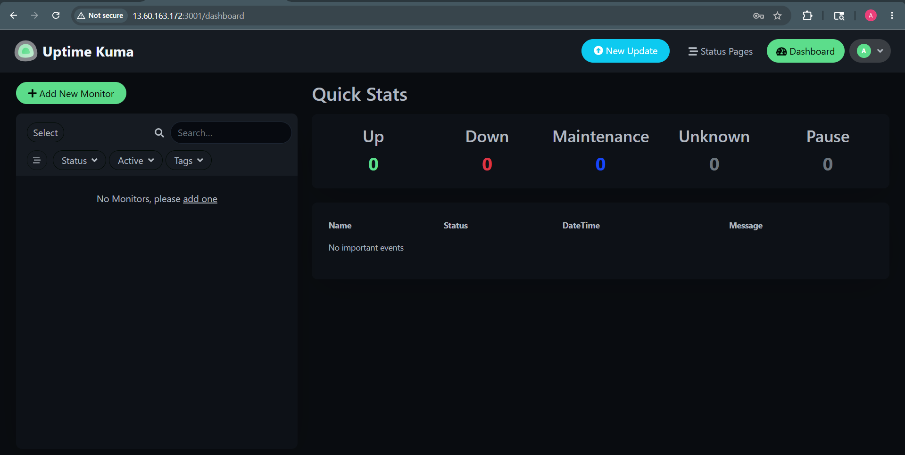
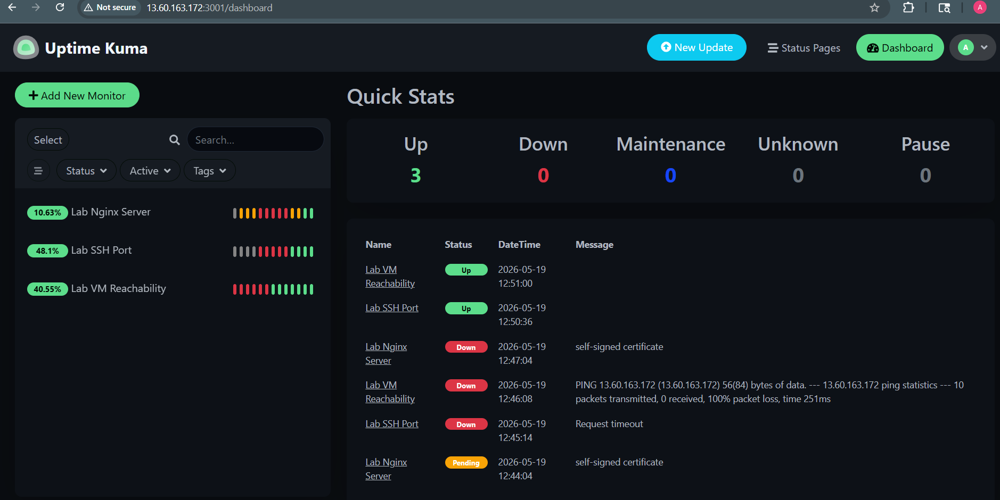
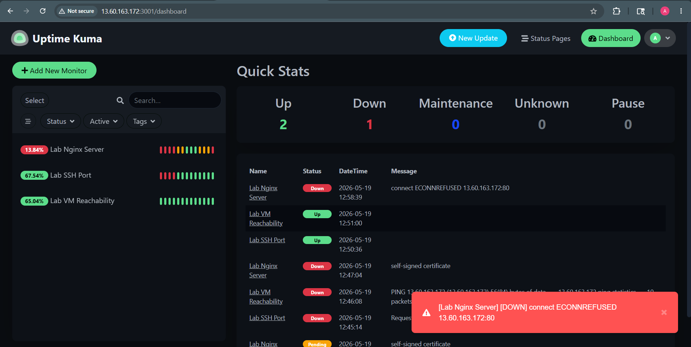
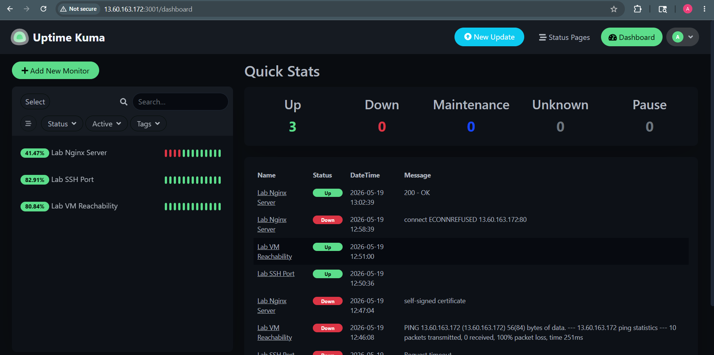

# Lab 3.1 — Uptime Kuma Monitoring Lab

## Objective

The objective of this lab was to deploy Uptime Kuma as an open-source uptime monitoring tool and configure monitors for lab services. The lab also demonstrated how a monitoring system detects service failure and recovery.

## Tools Used

- AWS EC2 Ubuntu VM
- Docker
- Uptime Kuma
- Nginx
- SSH
- Browser

## Step 1 — Uptime Kuma Deployment

Uptime Kuma was deployed using Docker on the monitoring VM.

Commands used:

```bash
docker pull louislam/uptime-kuma:1

docker run -d --restart=always --name uptime-kuma \
-p 3001:3001 \
-v uptime-kuma:/app/data \
louislam/uptime-kuma:1
```
After deployment, the Uptime Kuma web dashboard was accessed on port 3001 using the VM public IP.

Screenshot evidence:


## Step 2 — Monitor Creation

Three monitors were created in Uptime Kuma:
| Monitor Name        | Monitor Type | Target                                       |
| ------------------- | ------------ | -------------------------------------------- |
| Lab Nginx Server    | HTTP(s)      | [http://13.60.163.172](http://13.60.163.172) |
| Lab SSH Port        | TCP Port     | 172.31.38.99:22                              |
| Lab VM Reachability | Ping         | 172.31.38.99                                 |
After creating the monitors, the monitors were verified from the Uptime Kuma dashboard.

Screenshot evidence:


## Step 3 — Failure Simulation

To simulate a service failure, the nginx service was stopped on the VM.

### Command used:
```
sudo systemctl stop nginx
```
After nginx was stopped, Uptime Kuma detected the failure and marked the Lab Nginx Server monitor as down.

Screenshot evidence:


## Step 4 — Recovery Verification

The nginx service was started again to verify recovery detection.

### Command used:
```
sudo systemctl start nginx
```
After nginx was restored, Uptime Kuma detected the recovery and the monitor returned to up status.

Screenshot evidence:

## Mapping Uptime Kuma Monitor Types to Site24x7
| Uptime Kuma Monitor Type     | Similar Site24x7 Monitor Type         | Use Case                                                                                    |
| ---------------------------- | ------------------------------------- | ------------------------------------------------------------------------------------------- |
| HTTP(s) Monitor              | Website Monitor                       | Used to monitor web applications, login pages, portals, and public websites                 |
| TCP Port Monitor             | Port Monitor                          | Used to check whether services like SSH, database ports, or application ports are reachable |
| Ping Monitor                 | Server / Network Availability Monitor | Used to verify whether a VM or network device is reachable                                  |
| Docker-based Monitoring Tool | Infrastructure Monitoring             | Used to monitor internal lab services and service uptime                                    |

## Which monitor type would be used for an InstaSafe Gateway?

For an InstaSafe Gateway, I would use a combination of monitor types:
Ping Monitor to check whether the gateway VM is reachable.
TCP Port Monitor to verify important service ports are open and responding.
HTTP(s) Monitor if the gateway exposes a web portal, admin UI, or health-check endpoint.

This combination gives better visibility because it checks network reachability, service availability, and application-level response.

## Conclusion

In this lab, I deployed Uptime Kuma using Docker, configured three monitors, triggered a failure by stopping nginx, and verified that Uptime Kuma detected both the outage and the recovery. This helped me understand how uptime monitoring tools detect service availability and how similar monitoring concepts are used in enterprise tools like Site24x7.
