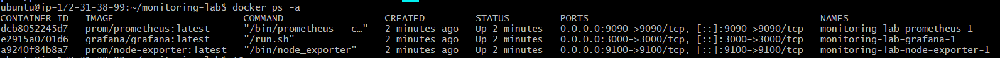
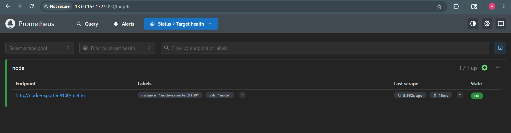
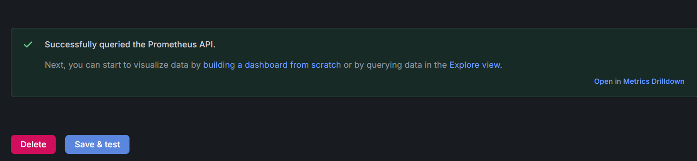
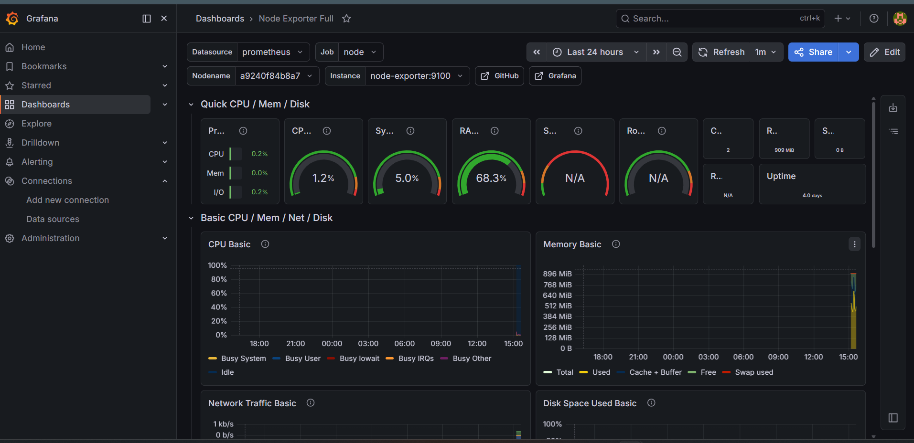
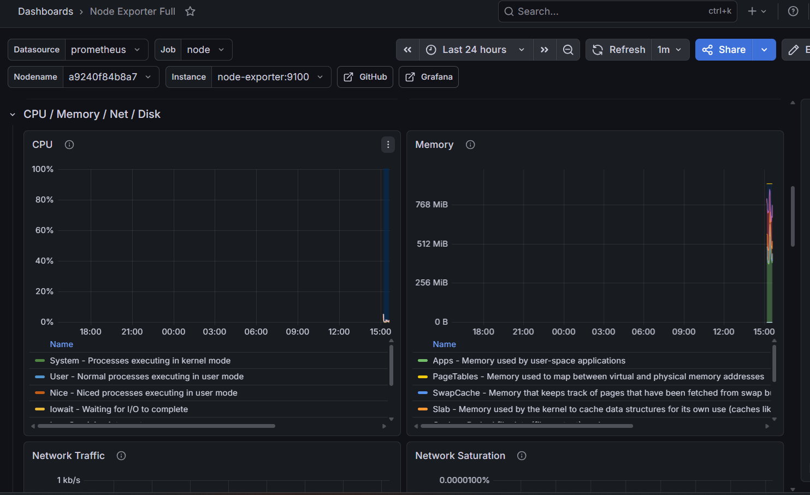

# Lab 3.2 — Prometheus and Grafana Monitoring Lab

## Objective

The objective of this lab was to deploy Prometheus, Grafana, and Node Exporter using Docker Compose, collect system metrics from the VM, and visualize those metrics in Grafana dashboards.

---

## Tools Used

- AWS EC2 Ubuntu VM
- Docker
- Docker Compose
- Prometheus
- Grafana
- Node Exporter
- Browser

---

## Step 1 — Docker Compose Setup

A Docker Compose file was created to deploy Prometheus, Grafana, and Node Exporter.

### `docker-compose.yml`

```yaml
version: '3.8'

services:
  prometheus:
    image: prom/prometheus:latest
    ports:
      - "9090:9090"
    volumes:
      - ./prometheus.yml:/etc/prometheus/prometheus.yml

  grafana:
    image: grafana/grafana:latest
    ports:
      - "3000:3000"
    environment:
      - GF_SECURITY_ADMIN_PASSWORD=Admin@Grafana123

  node-exporter:
    image: prom/node-exporter:latest
    ports:
      - "9100:9100"
````
### The services were started using:
```
docker compose up -d
```
The running containers were verified using:
```
docker compose ps
```


## Step 2 — Prometheus Target Verification

### Prometheus was accessed on port 9090.

URL used:
```
http://13.60.163.172:9090
```
The Prometheus target page showed the Node Exporter target as UP.


Prometheus was opened on port 9090 and the Node Exporter target was verified as UP.



### Step 3 — Grafana Data Source Configuration

Grafana was accessed on port 3000.

### URL used:
```
http://13.60.163.172:3000
```
### Login credentials used:
```
Username: admin
Password: Admin@Grafana123
```
### Prometheus was added as a Grafana data source using:
```
http://prometheus:9090
```
The connection test was successful.


Grafana was opened on port 3000 and Prometheus was added as a data source using the internal Docker service URL.



## Step 4 — Grafana Dashboard Import

The Node Exporter dashboard was imported in Grafana.

## Dashboard ID used:
``
1860
``
This dashboard displayed system metrics collected by Node Exporter and stored in Prometheus.



## Step 5 — Metrics Observed

The Grafana dashboard showed important VM metrics such as:

CPU usage
Memory usage
Disk usage
Network traffic
System load
Uptime



## Prometheus, Grafana, and Node Exporter Roles
| Component      | Role                                                            |
| -------------- | --------------------------------------------------------------- |
| Prometheus     | Collects and stores time-series metrics                         |
| Node Exporter  | Exposes Linux VM metrics such as CPU, memory, disk, and network |
| Grafana        | Visualizes Prometheus metrics using dashboards                  |
| Docker Compose | Runs all monitoring components together                         |

## Mapping to Site24x7
| Lab Component          | Similar Site24x7 Feature           |
| ---------------------- | ---------------------------------- |
| Prometheus             | Metrics collection backend         |
| Node Exporter          | Server monitoring agent            |
| Grafana Dashboard      | Infrastructure dashboard           |
| CPU/Memory/Disk panels | Server performance metrics         |
| Target UP status       | Availability monitoring            |
| Alerts                 | Threshold-based incident detection |

### Which metrics matter most for an InstaSafe Gateway?

For an InstaSafe Gateway, the most important metrics would be:

1.CPU usage — High CPU may indicate heavy traffic, encryption overhead, or service overload.
2.Memory usage — High memory usage can affect gateway stability.
3.Disk usage — Full disk can break logging, updates, or service operation.
4.Network traffic — Important for understanding tunnel traffic and gateway load.
5.Service availability — Gateway services must remain reachable for users.
6.System load — Helps identify overall VM pressure.

Monitoring these metrics helps detect gateway performance issues before users are affected.
