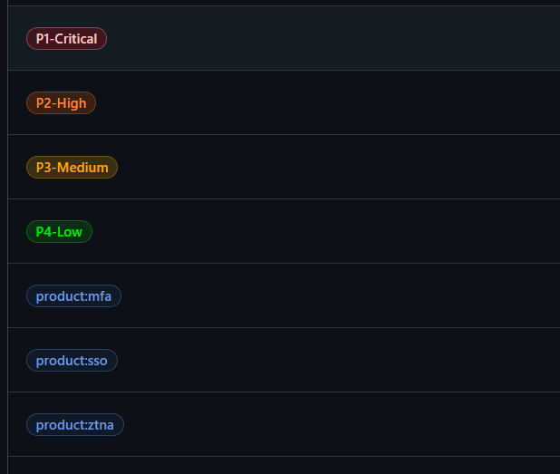
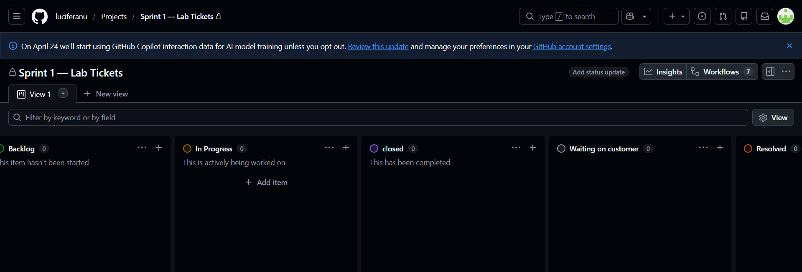
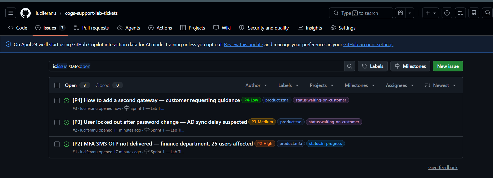
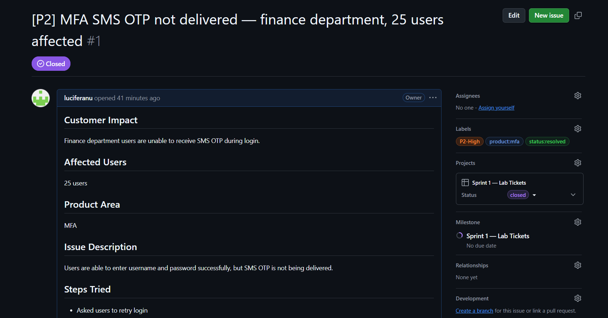
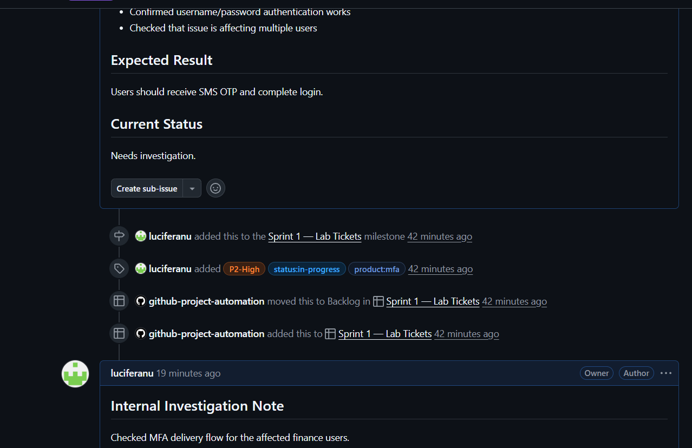
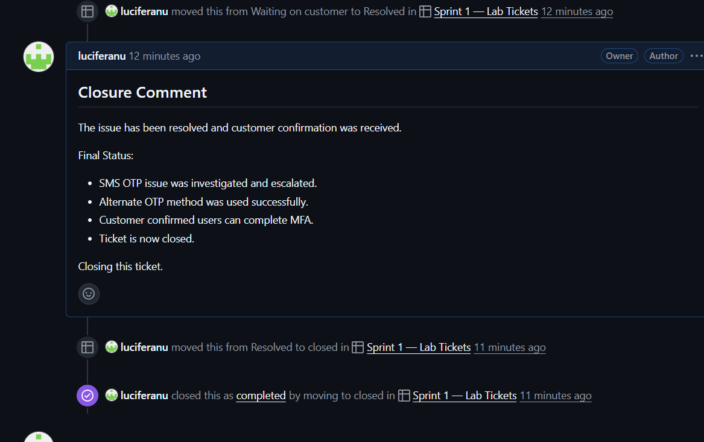
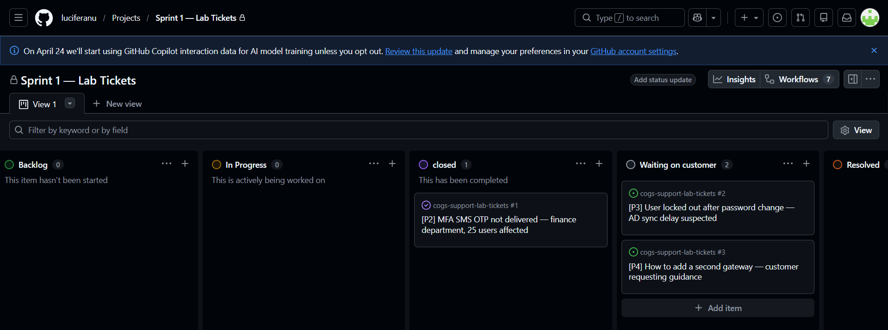

## GitHub Ticket Repository

The actual support ticket lifecycle was performed in a separate GitHub repository:

https://github.com/luciferanu/cogs-support-lab-tickets

This repository contains:
- GitHub Issues
- Labels
- Milestone
- Project board
- Internal investigation notes
- Escalation comments
- Resolution comments
- Ticket lifecycle workflow

### Direct References

- Ticket Repository: https://github.com/luciferanu/cogs-support-lab-tickets
- Issues Page: https://github.com/luciferanu/cogs-support-lab-tickets/issues
- Projects Board: https://github.com/users/luciferanu/projects

# Lab 4.1 — GitHub as a Support Desk

## Objective

The objective of this lab was to simulate a support desk workflow using GitHub Issues and GitHub Projects. The lab covered ticket creation, priority labeling, ticket triage, escalation, resolution, and closure.

---

## Tools Used

- GitHub Issues
- GitHub Projects
- GitHub Labels
- GitHub Milestones
- Browser

---

## Step 1 — Support Repository Setup

A separate GitHub repository was created to simulate a support ticketing system.

Repository created:

```text
cogs-support-lab-tickets
```
### Labels were created for priority, product area, and ticket status.

Priority labels:

-P1-Critical
-P2-High
-P3-Medium
-P4-Low

Status labels:

-status:in-progress
-status:waiting-on-customer
-status:resolved

Product labels:

-product:ztna
-product:mfa
-product:sso

A milestone named Sprint 1 — Lab Tickets was created.



A GitHub Project board was also created with the following columns:

Backlog
In Progress
Waiting on Customer
Resolved
Closed



## Step 2 — Mock Support Tickets Created

Three mock support tickets were created to simulate real support operations.

### Ticket 1

-[P2] MFA SMS OTP not delivered — finance department, 25 users affected

This ticket represented an MFA issue where finance department users were unable to receive SMS OTP during login.

### Labels used:

P2-High
product:mfa
status:in-progress

### Ticket 2
[P3] User locked out after password change — AD sync delay suspected

This ticket represented a suspected Active Directory sync delay after a user changed their password.

Labels used:

P3-Medium
product:sso
status:waiting-on-customer

### Ticket 3
-[P4] How to add a second gateway — customer requesting guidance

This ticket represented a low-priority customer guidance request related to adding a second gateway.

### Labels used:

P4-Low
product:ztna
status:waiting-on-customer



### Step 3 — Ticket Lifecycle Simulation

Ticket 1 was used to simulate a full support ticket lifecycle.







The lifecycle included:

Ticket creation
Internal investigation note
Escalation to L2
Waiting on customer / external confirmation
Resolution summary
Ticket closure

During the investigation, the issue was identified as being isolated to SMS OTP delivery. Username/password authentication was working, and email OTP was also working as an alternate MFA method.

The ticket was escalated to L2 to verify SMS provider logs, sender ID status, rejection codes, and possible carrier-level or DND-related blocking.

After investigation, the ticket was resolved by using an alternate OTP method while SMS delivery was being checked. Customer confirmation was received, and the ticket was closed.

## Step 4 — Final Project Board Status

The project board was updated to reflect the final support workflow status.

Final ticket status:
| Ticket                          | Final Status        |
| ------------------------------- | ------------------- |
| MFA SMS OTP not delivered       | Closed              |
| AD sync delay suspected         | Waiting on Customer |
| Second gateway guidance request | Waiting on Customer |



### Support Workflow Learning

This lab showed how GitHub Issues can be used as a simple support desk system. Labels helped classify priority, product area, and status. Milestones grouped related tickets together, while the project board provided a visual workflow for tracking ticket movement.

The ticket lifecycle demonstrated how support teams document internal investigation, escalate issues, provide resolution summaries, and close tickets after customer confirmation.
AD sync delay suspected	Waiting on Customer
Second gateway guidance request	Waiting on Customer

Support Workflow Learning

This lab showed how GitHub Issues can be used as a simple support desk system. Labels helped classify priority, product area, and status. Milestones grouped related tickets together, while the project board provided a visual workflow for tracking ticket movement.

The ticket lifecycle demonstrated how support teams document internal investigation, escalate issues, provide resolution summaries, and close tickets after customer confirmation.
## Difference Between GitHub Issues and Zoho Desk
| Feature                | GitHub Issues                                                 | Zoho Desk                                           |
| ---------------------- | ------------------------------------------------------------- | --------------------------------------------------- |
| Main Use               | Development issue tracking and lightweight support simulation | Dedicated customer support ticketing platform       |
| Ticket Creation        | Manual issue creation                                         | Email, chat, form, and portal-based ticket creation |
| Labels                 | Used for priority, product, and status classification         | Uses departments, statuses, priorities, and tags    |
| Workflow               | Managed using project board columns                           | Built-in ticket lifecycle workflows                 |
| Customer Communication | Comments inside issues                                        | Customer-facing email and portal communication      |
| SLA Management         | Manual tracking                                               | Built-in SLA policies and escalations               |
| Automation             | Limited GitHub automation                                     | Strong ticket automation and assignment rules       |
| Best Use               | Internal support simulation and engineering-linked tickets    | Real customer support operations                    |
