# Lab 5.1 — Kill the Gateway: P1 Incident Simulation

## Objective

The objective of this lab was to simulate a P1 gateway outage, detect the failure using Uptime Kuma, create and manage a GitHub incident ticket, investigate using monitoring tools, restore the service, and document the incident using PIR and PACE handover formats.

---

## Tools Used

- AWS EC2 Ubuntu VM
- Nginx
- Uptime Kuma
- Prometheus
- Grafana
- Node Exporter
- GitHub Issues
- GitHub Projects
- Markdown

---

## Scenario

The Lab Nginx Gateway was intentionally stopped to simulate a gateway outage.

Command used to trigger the incident:

```bash
sudo systemctl stop nginx
```
his caused the Uptime Kuma monitor for the Lab Nginx Server to go DOWN.

## Step 1 — Incident Detection

Uptime Kuma detected that the Lab Nginx Server was DOWN.

The monitor showed a connection refused error on port 80, confirming that the Nginx web service was not reachable.

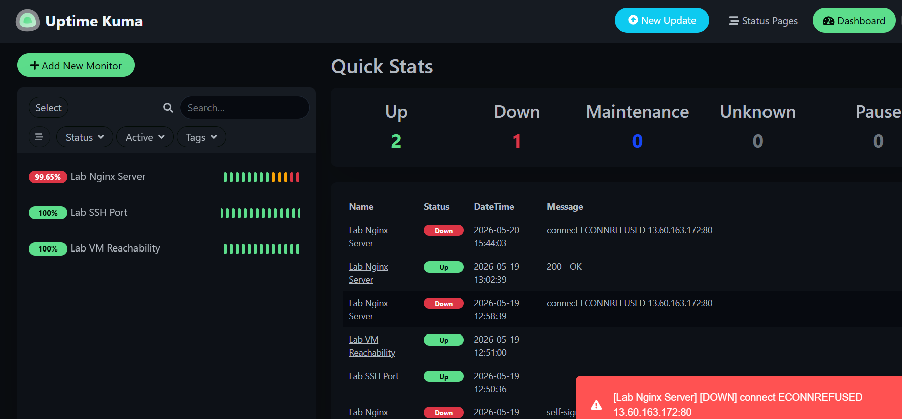

## Step 2 — P1 Ticket Creation

A P1 incident ticket was created in GitHub Issues to track the outage.

### Ticket title:
```
[P1] Lab Nginx Gateway Unreachable — All Users Offline
```
Labels used:
```
P1-Critical
product:ztna
status:in-progress
```
## Step 3 — Investigation

The Nginx service status was checked on the VM and showed that the service was stopped.

Prometheus was also checked to confirm that the VM-level monitoring target was still UP. This showed that the issue was not a full VM outage, but a service-level outage affecting Nginx.

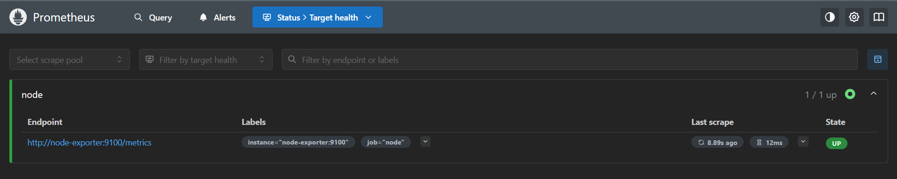

## Step 4 — Incident Timeline

The Uptime Kuma incident timeline showed the service going DOWN and later recovering.
### Observed timeline:
| Time (UTC) | Status | Message                               |
| ---------- | ------ | ------------------------------------- |
| 15:44      | Down   | connect ECONNREFUSED 13.60.163.172:80 |
| 16:05      | Up     | 200 - OK                              |
Approximate outage duration: 21 minutes

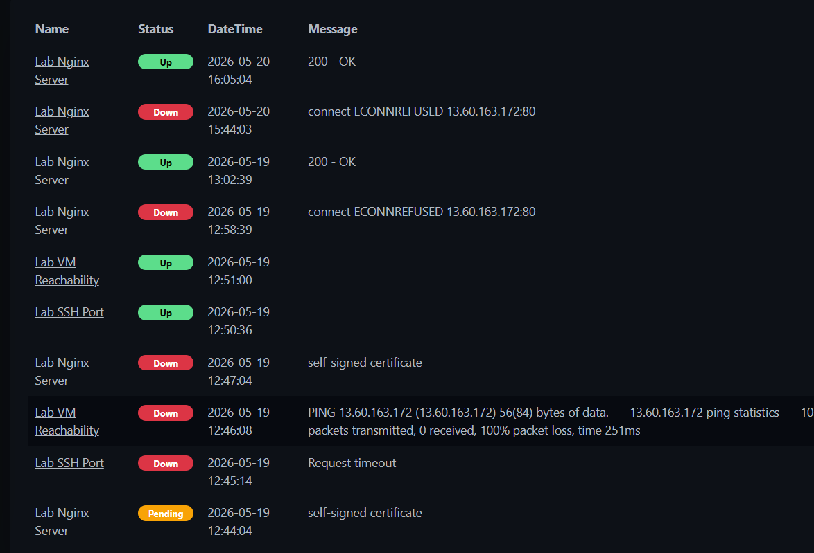

## Step 5 — Resolution

The Nginx service was restarted using:
```
sudo systemctl start nginx
```
After restarting Nginx, Uptime Kuma detected recovery and the Lab Nginx Server monitor returned to UP/green.

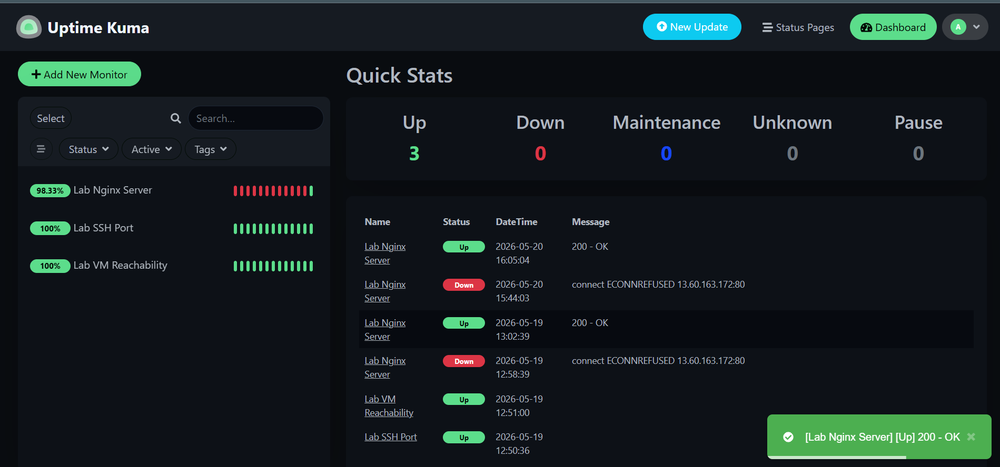

## Step 6 — Ticket Closure

A resolution summary and closure comment were added to the GitHub P1 ticket. The ticket was then moved to Closed status.

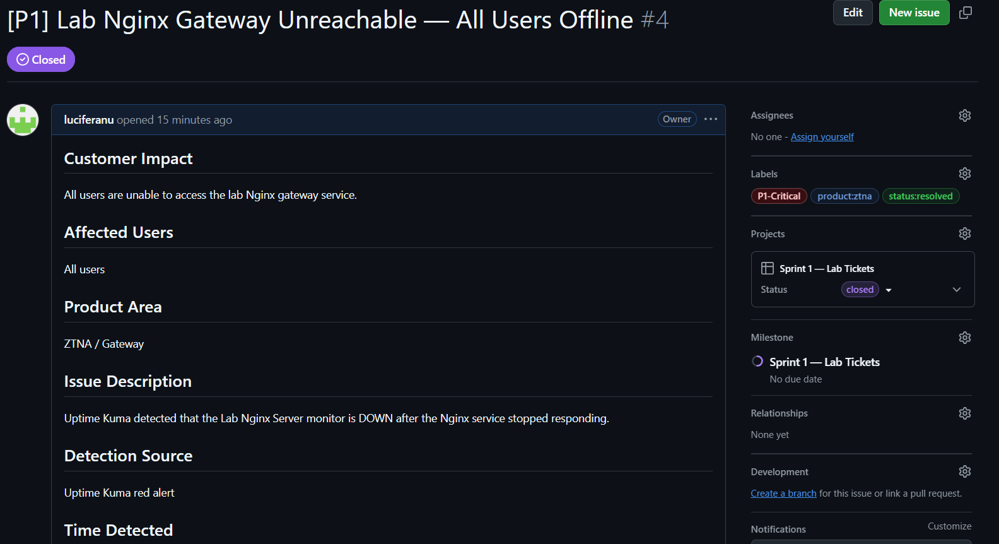

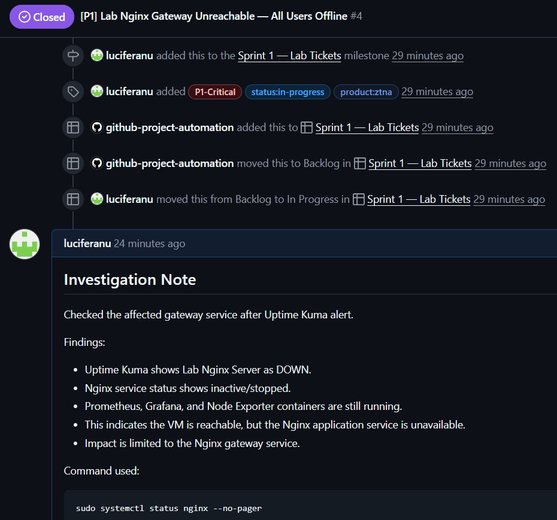

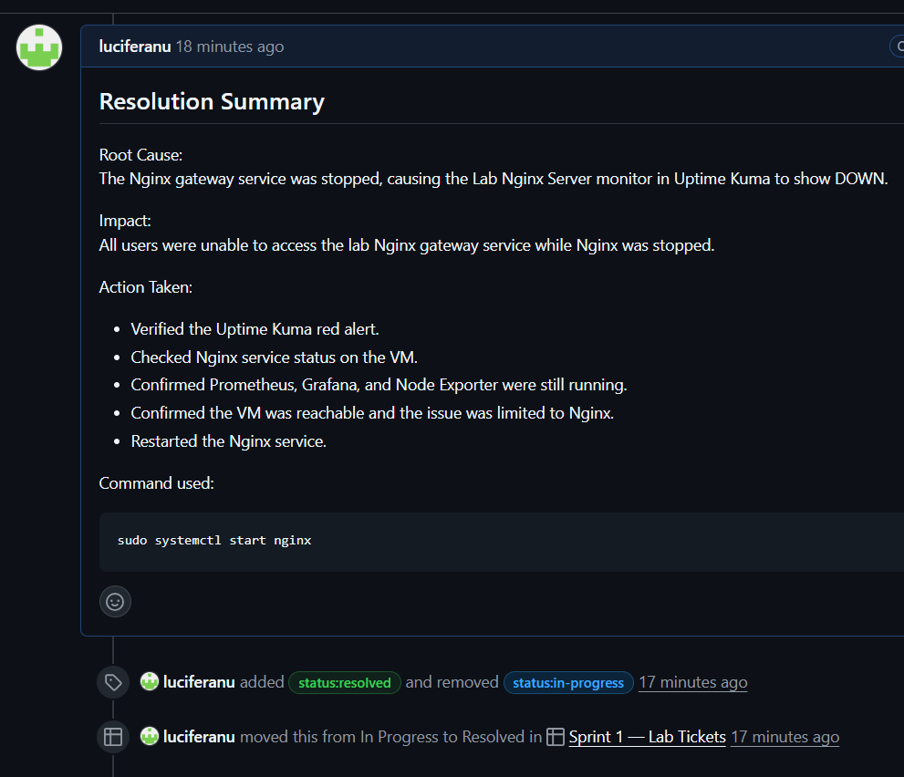

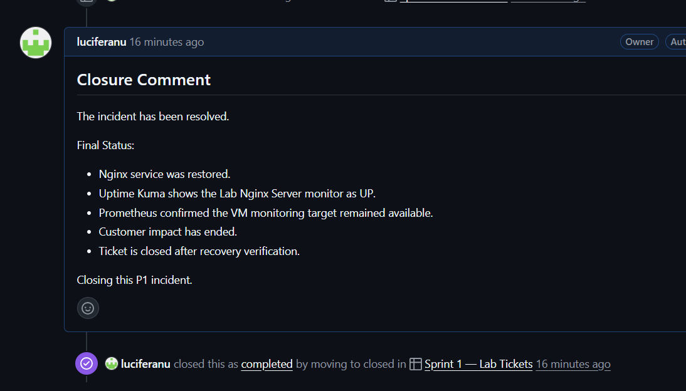

## Step 7 — Post-Incident Report

A PIR was created to document the incident summary, timeline, root cause, impact, resolution, prevention actions, and lessons learned.

### PIR file:

module-5-incidents/pirs/PIR-2026-05-20-Nginx-Gateway-Outage.md

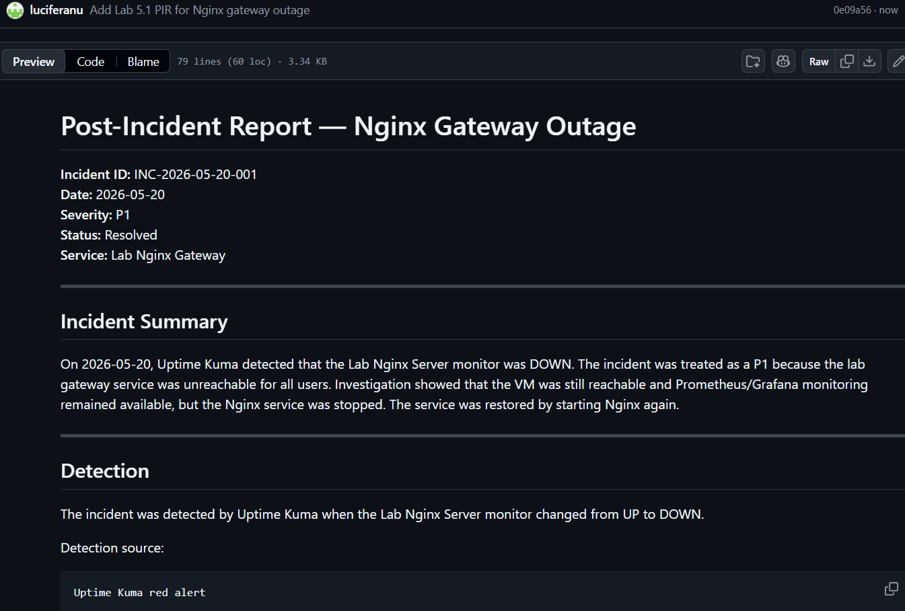

## Step 8 — PACE Handover

A PACE handover was created to simulate shift handover after the incident.

PACE handover file:
```text
module-5-incidents/handovers/handover-2026-05-20-p1-nginx-outage.md
```
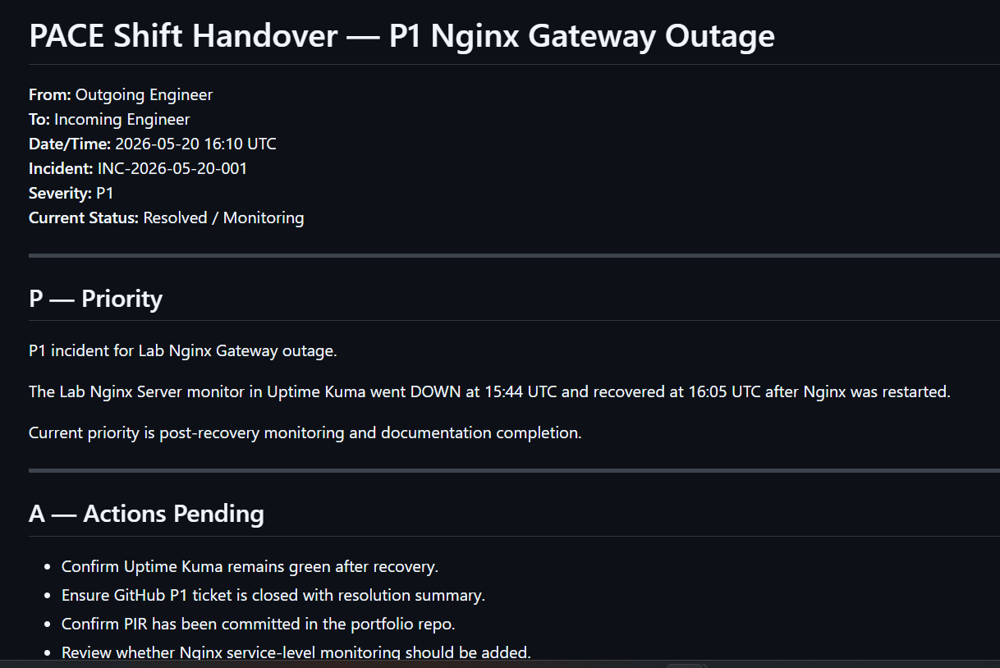

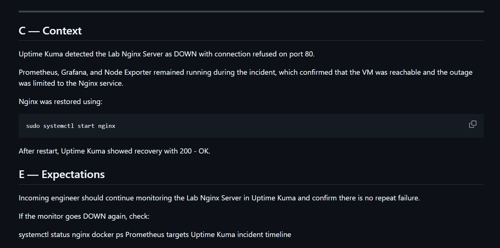

## Root Cause

The outage occurred because the Nginx service on the gateway VM was manually stopped during the simulation. Since the HTTP service on port 80 became unavailable, Uptime Kuma detected repeated connection-refused responses and triggered the incident condition.

The VM itself remained reachable, and Prometheus/Grafana monitoring continued to run normally. This confirmed that the incident was a service-level outage affecting Nginx rather than a full infrastructure or VM outage.

## Impact

| Field | Details |
|---|---|
| Severity | P1 |
| Affected Service | Lab Nginx Gateway |
| Affected Users | All users attempting to access the gateway |
| User Impact | Users were unable to access the HTTP gateway service because the Nginx web service on port 80 was unavailable |
| Business Impact | Gateway connectivity testing and application access through the lab environment were interrupted during the outage window |
| Outage Duration | Approximately 21 minutes |

## Resolution Summary

The Nginx service was restarted using sudo systemctl start nginx. After restart, Uptime Kuma detected recovery and the monitor returned to UP with a 200 - OK response.

## Prevention Actions

| Action | Owner | Purpose |
|---|---|---|
| Configure Uptime Kuma HTTP monitor for `/health` endpoint every 60 seconds | Support Engineering | Detect Nginx outages faster |
| Configure Prometheus alert when Nginx service becomes unavailable for more than 2 minutes | Monitoring Team | Reduce detection delay |
| Add Nginx service validation to operational runbook | Operations Team | Standardize troubleshooting steps |
| Add systemd auto-restart policy for Nginx service | Infrastructure Team | Improve automatic recovery |
| Configure escalation process for repeated P1 gateway outages | Incident Management Team | Improve incident response coordination |
| Create service-level dashboard for gateway availability metrics | Monitoring Team | Improve visibility into gateway health |
