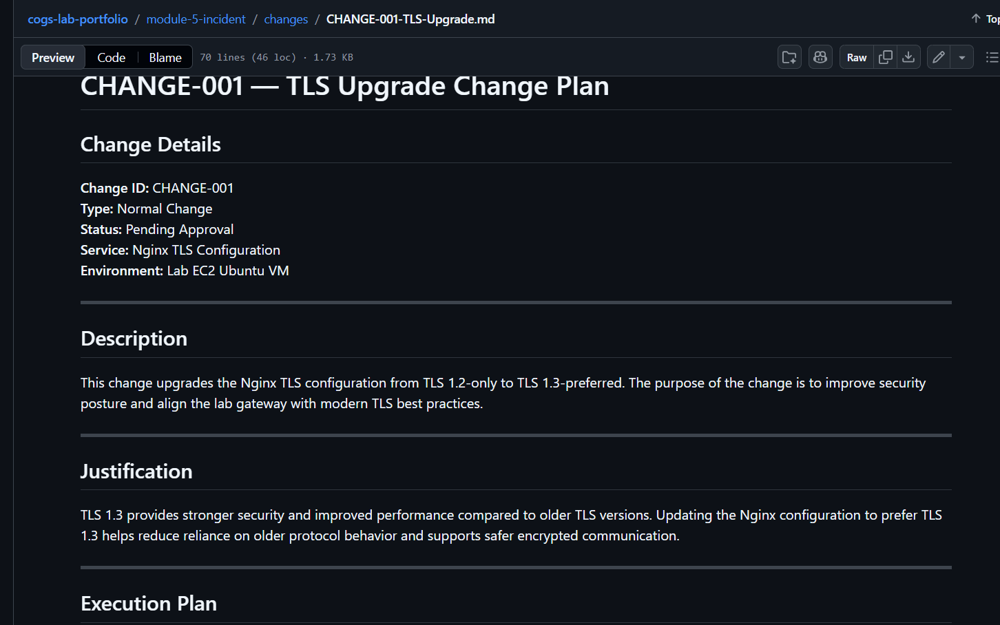
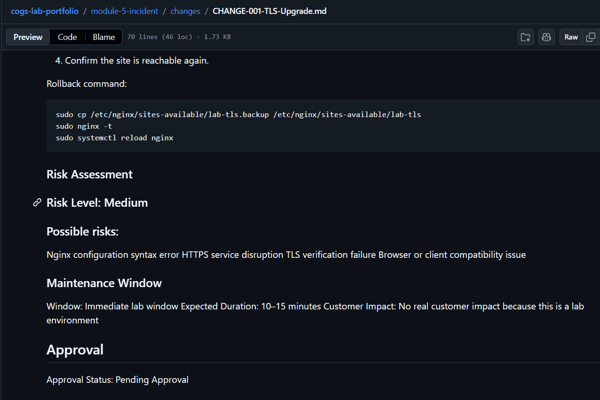
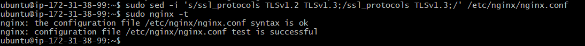
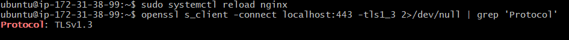
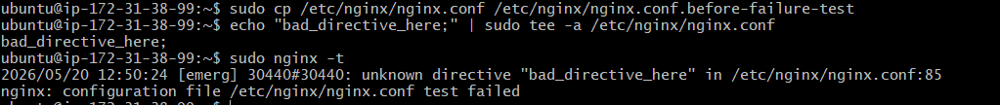
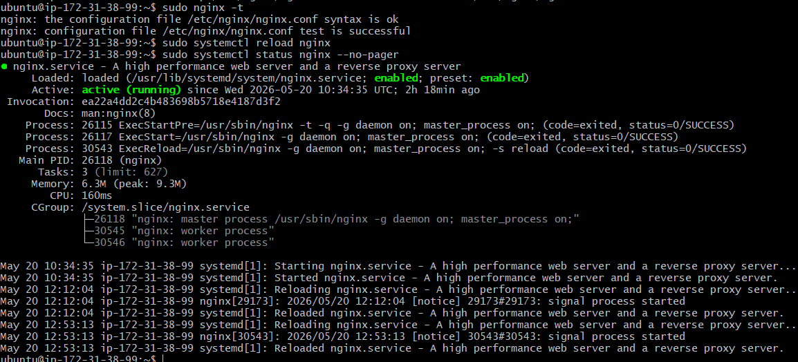
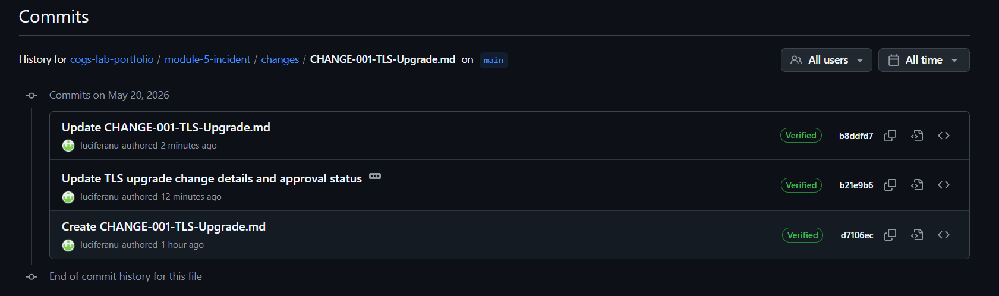

# Lab 5.2 — Change Management Simulation

## Objective

The objective of this lab was to practice a normal change process by writing a change plan before execution, implementing a TLS configuration change, validating the change, simulating a failed change, performing rollback, and documenting the full commit trail.

---

## Tools Used

- AWS EC2 Ubuntu VM
- Nginx
- OpenSSL
- GitHub
- Markdown

---

## Change Summary

This lab simulated a safe change on a live system by upgrading the Nginx TLS configuration to prefer TLS 1.3.

Change file:

```text
module-5-incident/changes/CHANGE-001-TLS-Upgrade.md
```
## Step 1 — Change Plan Created Before Execution

A change plan was created and committed before making any changes to the Nginx configuration.

### The plan included:

Change description
Justification
Execution steps
Rollback plan
Risk assessment
Maintenance window
Approval status





## Step 2 — Nginx Configuration Test Successful

After updating the TLS configuration, the Nginx configuration was tested using:
```
sudo nginx -t
```
The test showed that the syntax was OK and the configuration test was successful.



## Step 3 — TLS 1.3 Verification

The TLS configuration was verified using OpenSSL:
```
openssl s_client -connect localhost:443 -tls1_3 2>/dev/null | grep 'Protocol'
```
Observed result:
Protocol: TLSv1.3

This confirmed that TLS 1.3 was working.



## Step 4 — Rollback Trigger Simulation

A failed change scenario was simulated by intentionally adding an invalid directive to the Nginx configuration.

The configuration test failed, proving that the bad change was detected before reload.



## Step 5 — Rollback Execution

The previous working Nginx configuration was restored from backup.

The rollback was verified by running:
```
sudo nginx -t
sudo systemctl reload nginx
sudo systemctl status nginx --no-pager
```
The configuration test succeeded and Nginx returned to active/running state.



## Step 6 — Git Commit Trail

The GitHub file history shows the full change lifecycle:

Change plan created before execution
TLS upgrade implementation committed
Rollback test evidence committed



## Result

The change was successfully planned, implemented, validated, and rollback-tested.

TLS 1.3 was confirmed working, and the rollback process restored Nginx successfully after a simulated configuration failure.

